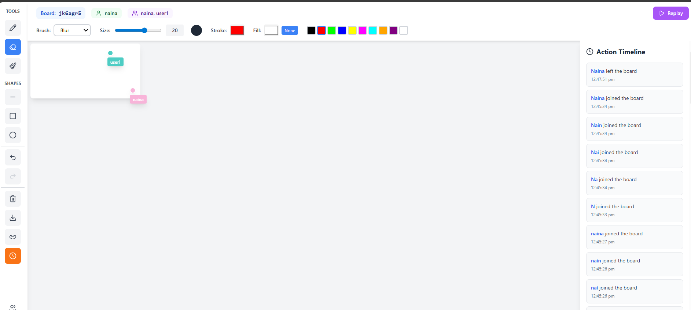
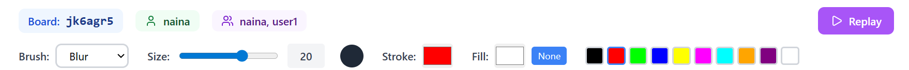
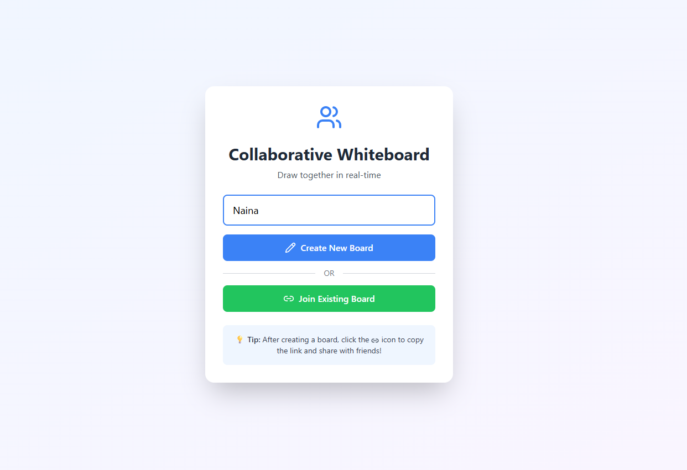
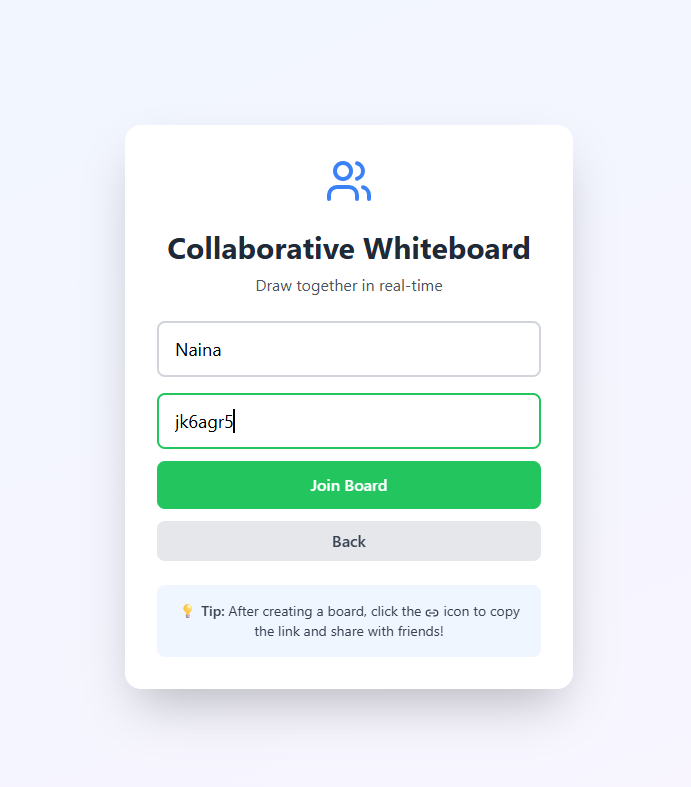
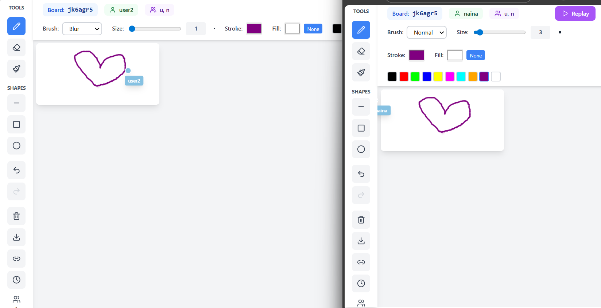

# DrawTogether 🎨
A real-time collaborative whiteboard app built with React, Vite, and Tailwind CSS. Allows multiple users to draw, choose brushes, colors, and see action timelines in real-time.

## Features
- Real-time collaborative drawing
- Multiple brush types (Normal, Blur, Spray, Marker, Glow)
- Adjustable brush size
- Stroke and fill color pickers
- Default color palette for quick selection
- Replay past actions
- Timeline panel to view drawing history
- Active users display
- Copy board link for sharing

## Tech Stack
- Frontend: React, Vite, Tailwind CSS
- Icons: lucide-react
- Real-time Communication: (optional) WebSockets / Socket.IO
- Version Control: Git & GitHub

## Installation

1. **Clone the repository:**

````git clone https://github.com/NainaKothari-14/drawtogether.git````

2. Install dependencies:

````cd drawtogether````
````npm install````

3. Run the app locally:

````npm run dev````

4. Open your browser at the address shown in the terminal (usually http://localhost:5173)

## Usage
- Click Copy Link to share the board with others.
- Use the Timeline button to view drawing history.
- Select brush type, size, stroke, and fill color to start drawing.
- Click Replay to see past drawing actions.
- Active users and their count are displayed at the top.

## Screenshots
### Board

### Toolbar

### Joining a Board

### Join Existing Board

### Collaborative Drawing


## Contributing
Contributions are welcome!  
1. Fork the repository  
2. Create a new branch (`git checkout -b feature-name`)  
3. Make your changes and commit (`git commit -m "Add feature"`)  
4. Push to your branch (`git push origin feature-name`)  
5. Open a Pull Request  

## License
This project is licensed under the MIT License.
